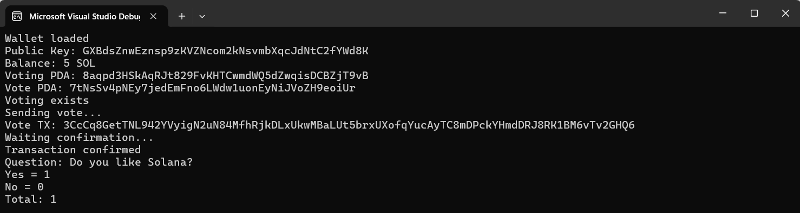

# Technical Report: SolanaVoting

## 1. Project Overview

The goal of this project was to design and implement a simple on-chain voting system on the Solana blockchain.  
The system consists of:

- A smart contract written in Rust using the Anchor framework.
- A console client written in C# using the Solnet library.

The voting system supports:
- One question per voting session.
- 2–3 answer options.
- Recording votes on-chain.
- Counting voting results on-chain.

The project was deployed and tested on Solana Testnet.

---

## 2. System Architecture

### Smart Contract (Rust + Anchor)

The smart contract provides two main instructions:

1. **initialize_voting**
   - Creates a PDA-based VotingAccount.
   - Stores the question and answer options.
   - Initializes vote counters.

2. **vote**
   - Creates a VoteAccount PDA for each voter.
   - Ensures one vote per wallet.
   - Updates vote counters and total vote count.

The contract stores all data on-chain using Anchor account serialization.

---

### Client Application (C#)

The C# console client performs the following steps:

1. Loads a Solana wallet from `id.json`.
2. Connects to Solana Testnet via RPC.
3. Derives PDA addresses for voting and votes.
4. Initializes voting (if not already initialized).
5. Sends a vote transaction.
6. Reads and decodes on-chain voting results.

The client manually encodes Anchor instructions and decodes Anchor account data.

---

## 3. What Works

The following functionality is fully implemented and tested:

- Wallet loading and RPC connection
- PDA derivation for voting and vote accounts
- Smart contract deployment using Anchor
- Voting initialization on-chain
- Vote submission with per-user vote restriction
- On-chain vote counting
- Decoding Anchor account data in C#
- Console output of voting results

Example console output:

---

## 4. What Does Not Work / Limitations

### Technical Limitations

- The system supports only a single question per voting session.
- No voting closing mechanism (voting is always open).
- No admin control or voting lifecycle management.
- No prevention of voting via multiple wallets.
- No frontend UI (console only).

### Implementation Limitations

- Anchor account sizes are manually calculated and fixed.
- Data serialization is manually decoded in C# (no official SDK).
- Error handling is minimal and mostly console-based.

---

## 5. Key Learnings

During this project the following knowledge and skills were acquired:

- Solana blockchain fundamentals (accounts, PDAs, transactions).
- Writing smart contracts in Rust with Anchor.
- Manual Anchor instruction encoding and decoding.
- Solana RPC interaction from C# using Solnet.
- PDA derivation logic and seed design.
- On-chain data storage and serialization.
- End-to-end blockchain application architecture.

---

## 6. Conclusion

This project successfully demonstrates a Proof of Concept for a decentralized voting system on Solana.  
The solution shows how to integrate Rust smart contracts with a C# client without an official SDK.

Despite limitations, the PoC confirms that Solana can be integrated into .NET applications and supports custom on-chain governance logic.

Future improvements may include:
- Voting lifecycle management (open/close states)
- UI frontend (Web or Desktop)
- Signature-based identity verification
- Database indexing of votes
- Multi-question voting support

---
